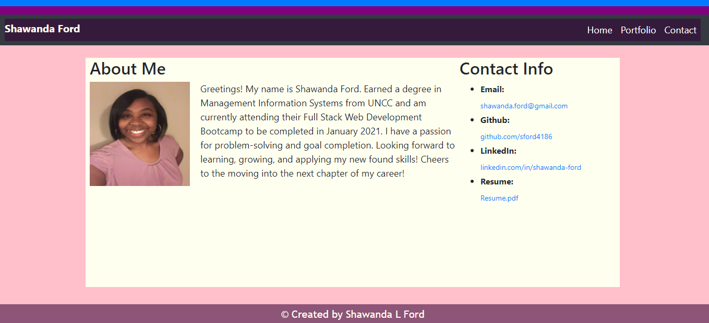

# react-portfolio

The objective of this assignment is to create a responsive portfolio website using react that works well on various window or screen sizes.  

## Screenshot of Website  
;

## Github Link
Github Link: (https://github.com/sford4186/react-portfolio)

## Deployed site

[Responsive-Portfolio](https://sford4186.github.io/Re-Portfolio/)

